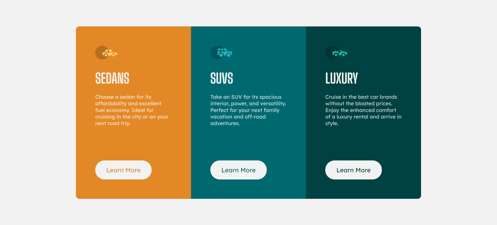
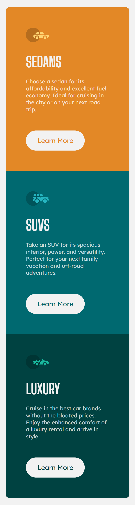

# Frontend Mentor - 3-column preview card component solution

This is a solution to the [3-column preview card component challenge on Frontend Mentor](https://www.frontendmentor.io/challenges/3column-preview-card-component-pH92eAR2-). Frontend Mentor challenges help you improve your coding skills by building realistic projects.

## Table of contents

- [Overview](#overview)
  - [The challenge](#the-challenge)
  - [Screenshot](#screenshot)
  - [Links](#links)
- [My process](#my-process)
  - [Built with](#built-with)
  - [What I learned](#what-i-learned)
  - [Continued development](#continued-development)
- [Author](#author)

## Overview

### The challenge

Users should be able to:

- View the optimal layout depending on their device's screen size
- See hover states for interactive elements

### Screenshot




### Links

- Live Site URL: [live site](https://omaryasserm.github.io/3-column-preview/)

## My process

### Built with

- Semantic HTML5 markup
- CSS custom properties

### What I learned

a trick i used to make the color of the text at buttons the same as the color of the column

```css
.column > button {
  color: inherit;
}
```

### Continued development

making responsive designs is still challenging, but fun part of css! gonna keep learning how to do things the best way.

## Author

- Website - [soon](soon)
- Frontend Mentor - [@omarYasserM](https://www.frontendmentor.io/profile/omarYasserM)
- LinkedIn - [@omar yasser](https://www.linkedin.com/in/omar-yasser-33525717a/)
